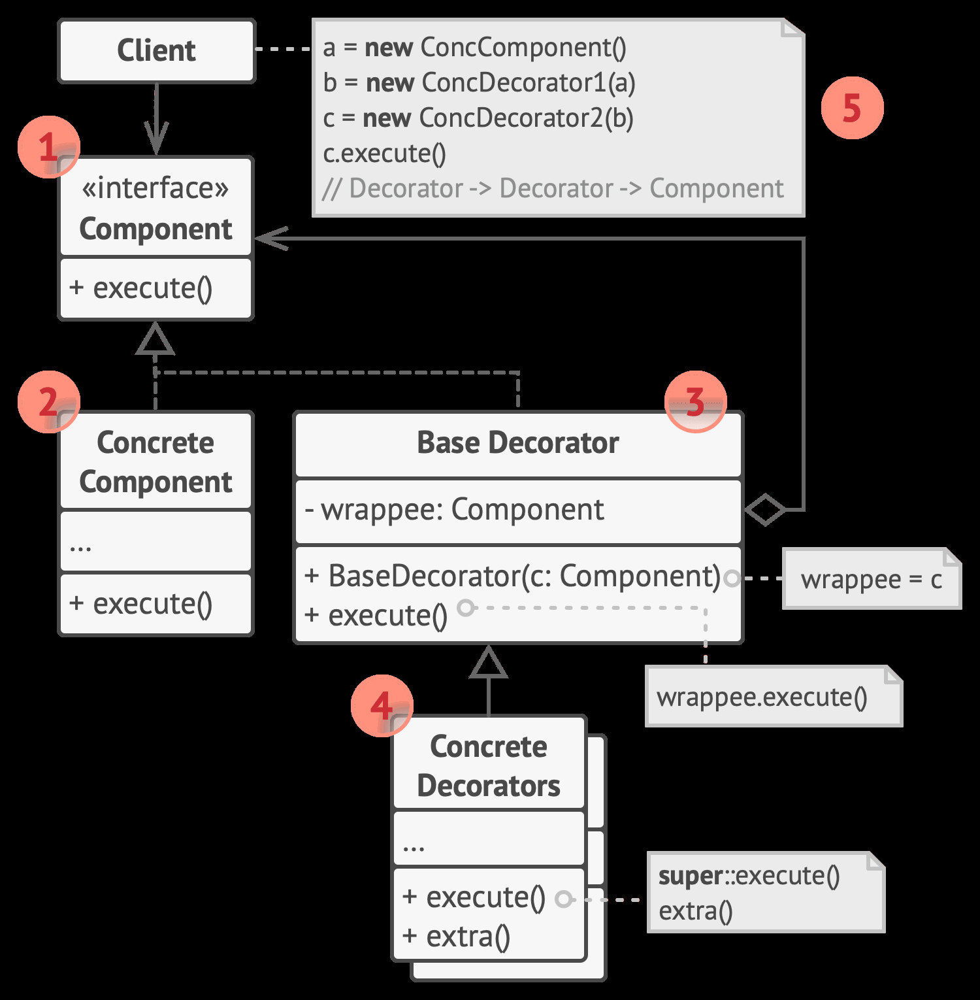

## Decorator (装饰器) 模式 

使用组合的方式，在运行时动态拓展对象的功能（累加式），避免了继承带来的重发代码和多子类衍生问题。

关键：运行时拓展，不改变原有接口；

[implement](./implement/Decorator.cpp)

1. 功能接口 声明顶层抽象接口
2. 功能组件 实现接口基础功能
3. 基础装饰器 组合接口引用，实现接口（直接封装基础接口实现）
4. 具体装饰器 保留接口，获取基础功能，并拓展

> 使用组合的方式拓展现存接口的功能

**特点：** 继承并聚合接口