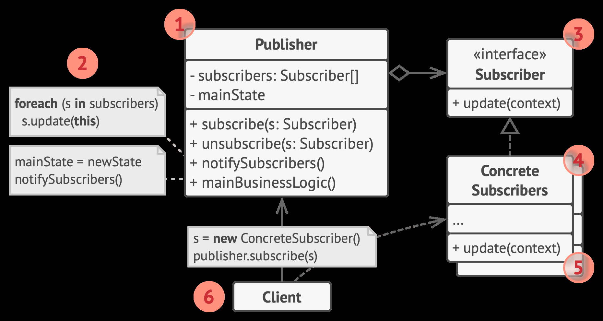

## Observer (观察者)模式

定义一种订阅机制，在对象事件发生时通知多个“观察”该对象的其他对象。

[implement](./implement/Observer.cpp)

发布者定义订阅和解除订阅接口，保存订阅者引用

订阅者定义 update() 接口，用于发布者通知所有订阅者

发布者和订阅者都只依赖于订阅者接口

1. 发布者（Publisher）会向其他对象发送值得关注的事件。事件会在发布者自身状态改变或执行特定行为后发生。发布者中包含一个允许新订阅者加入和当前订阅者离开列表的订阅构架。

2. 当新事件发生时，发送者会遍历订阅列表并调用每个订阅者对象的通知方法。该方法是在订阅者接口中声明的。

3. 订阅者（Subscriber） 接口声明了通知接口。在绝大多数情况下，该接口仅包含一个 update 更新方法。该方法可以拥有多个参数，使发布者能在更新时传递事件的详细信息。

4. 具体订阅者（Concrete Subscribers）可以执行一些操作来回应发布者的通知。所有具体订阅者类都实现了同样的接口，因此发布者不需要与具体类相耦合。