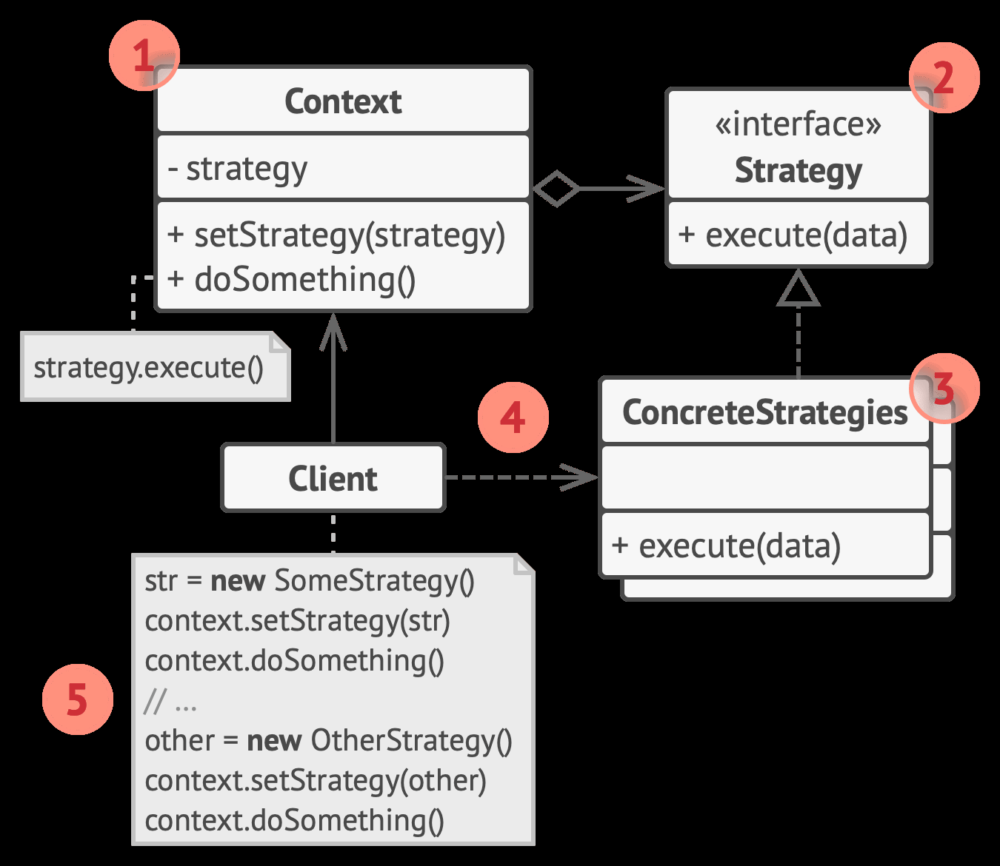

## Strategy （策略）模式

定义一系列算法分别用独立的类实现，以使算法的不同实现对象能够相互替换。

[implement](./implement/Strategy.cpp)

将某一算法抽象为一个接口类，被其他类聚合（组合）并调用（不变）

用户动态传入算法的不同实现对象，达成关键动作的多态性（变化）

1. 上下文（Context）维护指向具体策略的引用，且仅通过策略接口与该对象进行交互。
2. 策略（Strategy）接口是所有具体策略的通用接口， 它声明了一个上下文用于执行策略的方法。
3. 具体策略（Concrete Strategies）实现了上下文所用算法的各种不同变体。
4. 特定用户依赖于特定算法
5. 客户端（Client） 会创建特定策略对象并将其传递给上下文用于交互。

