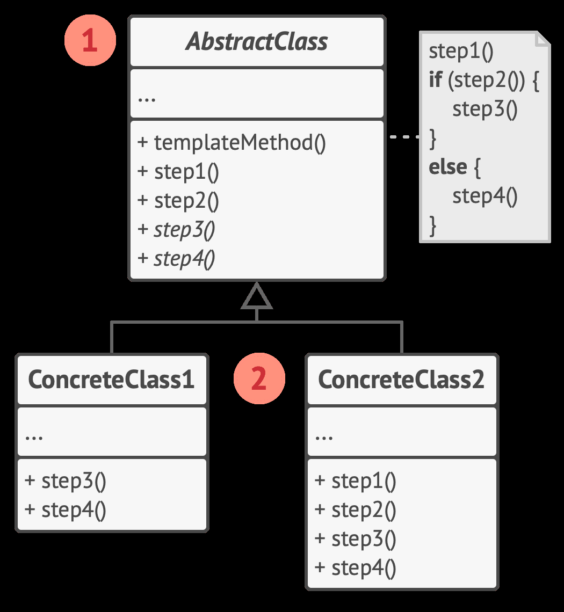

## Template Method （模板方法） 模式

在超类中定义了一个算法的框架，允许子类在不修改结构的情况下重写算法的特定步骤。

[implement](./implement/Template_Method.cpp)

将算法分解为一系列步骤， 然后将这些步骤改写为方法， 最后在“模板方法” 中依次调用这些方法。(不变)

通过多态来实现这些步骤。（变化）

**步骤的顺序是不变的，步骤的内容是变化的**

 1. 抽象类（AbstractClass） 声明作为算法步骤的方法， 以及依次调用它们的实际模板方法。 算法步骤可以被声明为 抽象 类型， 也可以提供一些默认实现。
 2. 具体类（ConcreteClass）可以重写所有步骤，但不能重写模板方法自身。